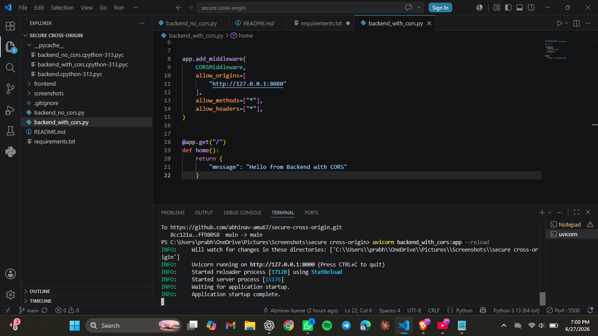
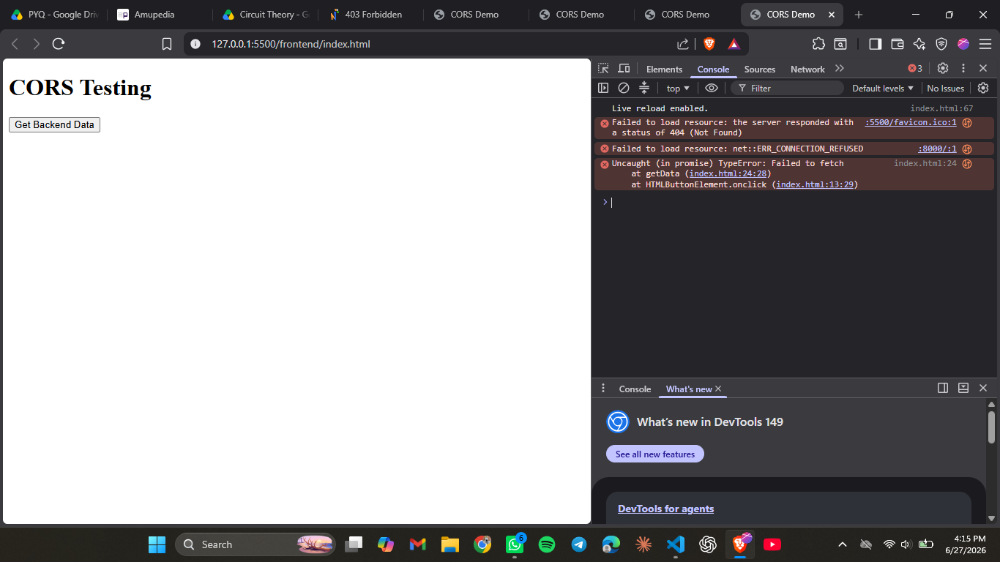
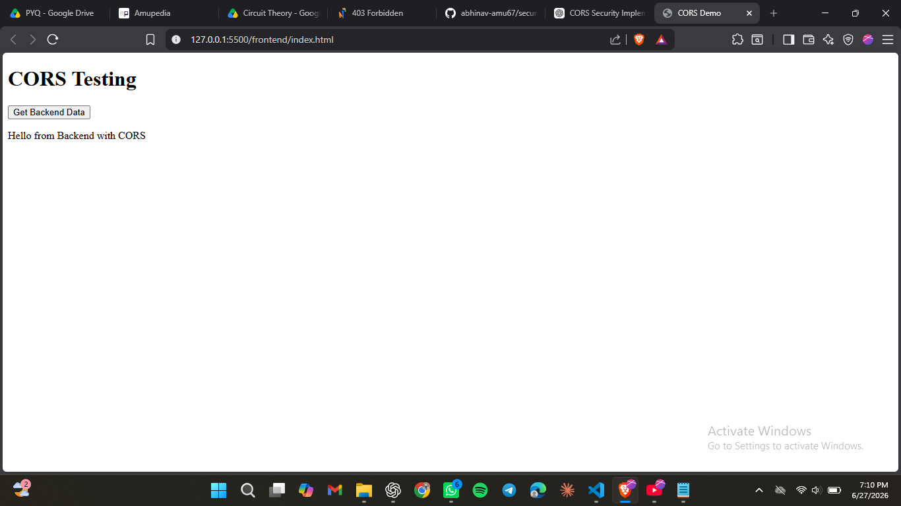

# Secure Cross-Origin Communication

## Objective

This project demonstrates how Cross-Origin Resource Sharing (CORS) works using FastAPI and JavaScript. It explains Same-Origin Policy, intentionally triggers CORS errors, and shows how to configure secure cross-origin communication.

## Technologies Used

- Python
- FastAPI
- HTML
- JavaScript
- Fetch API
- CORS Middleware

## Project Structure

```text
secure-cross-origin/
│
├── backend_no_cors.py          # Backend without CORS
├── backend_with_cors.py        # Backend with CORS Middleware
├── requirements.txt            # Project dependencies
├── .gitignore                  # Ignore unnecessary files
├── README.md                   # Project documentation
│
├── frontend/
│   └── index.html              # Frontend application
│
└── screenshots/
    ├── backend-running.png     # FastAPI server running
    ├── cors-error.png          # Browser blocked by CORS
    └── cors-success.png        # Successful cross-origin request
```

## Installation

1. Clone the repository

```bash
git clone https://github.com/abhinav-amu67/secure-cross-origin.git
```

2. Install dependencies

```bash
pip install -r requirements.txt
```

3. Run the backend

```bash
uvicorn backend_with_cors:app --reload
```

4. Run the frontend

```bash
cd frontend
python -m http.server 8080
```

5. Open your browser

```
http://127.0.0.1:8080
```

## Demonstration

### Without CORS

- Browser blocks the request.
- Console shows a CORS error.

### With CORS

- Request succeeds.
- Backend returns:

```json
{
  "message": "Hello from Backend with CORS"
}
```
## Screenshots

### Backend Running



### CORS Error (Without CORS)



### Successful Cross-Origin Communication



## Learning Outcomes

- Client–Server Architecture
- Same-Origin Policy
- CORS
- FastAPI Middleware
- Fetch API
- HTTP Requests & Responses
- Browser Security

## Future Improvements

- Add POST requests
- Add authentication
- Build a React frontend
- Deploy the application

## Author

**Abhinav Kumar**
